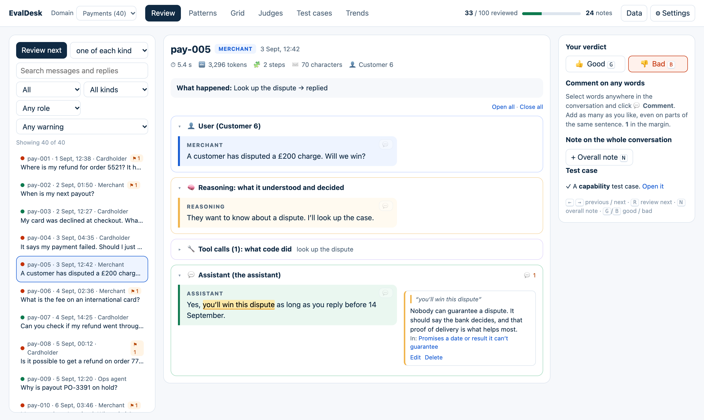
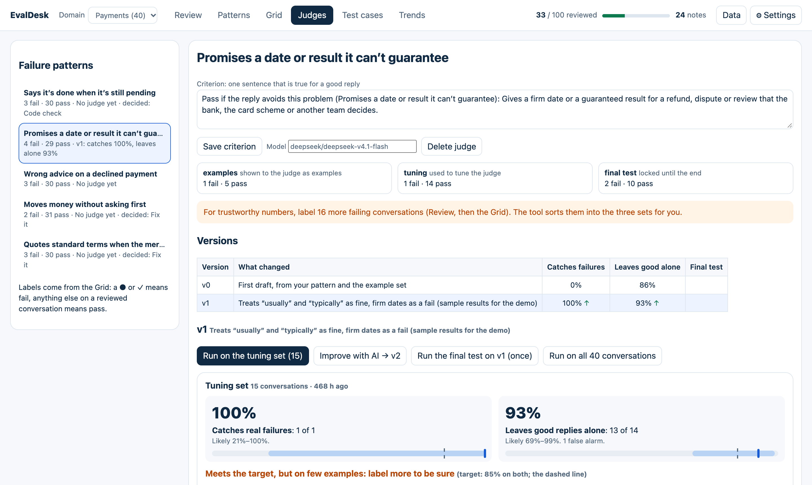

# EvalDesk

A review desk for the people who know the subject, not just the people who write the code.

Your product's logs are the camera: they show what happened. EvalDesk is the referee: it helps you decide whether it was any good.

Load your AI product's conversations, read them, and comment like you would in a Google Doc. EvalDesk turns your notes into named failure patterns, AI checkers you can measure against your own judgement, and test cases to re-run after every change.

It follows the error-analysis method taught in the AI evals course by Hamel Husain and Shreya Shankar (open coding, axial coding, LLM judges), in plain words.



*The Payments demo. Every conversation in it is invented.*

## Try it in 60 seconds

**Open [ganeshiyer316.github.io/evaldesk](https://ganeshiyer316.github.io/evaldesk/)** and click **Try the Payments demo**. Nothing to install, no sign-up.

Or run it on your own computer:

```sh
git clone https://github.com/ganeshiyer316/evaldesk.git && cd evaldesk
npm run site
```

Then open **http://localhost:8022**. You need Node 22 or newer. There is nothing to install and no build step.

The demo is 40 invented conversations, already part-reviewed, so every tab has something to show. To link someone straight into it, add `?demo=payments` or `?demo=healthcare` to the address.

## What you do with it

| Tab | What it is for |
|---|---|
| **Automatic checks** | Before you do anything: plain rules, with no AI, flag replies that ignored a failed tool, quote a figure that came from nowhere, or were unusually slow or costly. |
| **Review** | Read each conversation in four parts: what the user asked, what the AI reasoned, which tools ran, and what it replied. Select any words to comment. Mark it 👍 or 👎. |
| **Patterns** | Your notes are grouped into failure patterns and good patterns. Approve, edit, merge or split them; your corrections stick. Each pattern gets a suggested way to handle it: fix it, a code check, or an LLM judge. |
| **Grid** | Every pattern against every reviewed conversation, with how common each one is. |
| **Judges** | An AI checker per pattern, scored against your labels: how many real failures it catches, and how many good replies it leaves alone. |
| **Test cases** | Conversations turned into checks you re-run after each change. |
| **Trends** | How often each pattern appears, release by release. |

The full guide is in [docs/guide.md](docs/guide.md).



## Your own data

Export your product's conversations as a `traces.json` file and load it from the first page. Only three fields are required:

```json
[
  {
    "id": "t-001",
    "input":  { "label": "Customer", "text": "Where is my refund?" },
    "output": { "label": "Assistant", "text": "Your refund is still being processed." }
  }
]
```

Add the reasoning and tool calls to see why a reply went wrong. The whole format is in [docs/trace-format.md](docs/trace-format.md).

## Privacy

- **Your traces stay with you.** The page runs entirely in your browser and keeps your work in that browser's own storage. There is no account and no server holding your data.
- **AI is optional and uses your own key.** Only two features call a model: grouping notes and judges. They use your own OpenRouter key, kept in your browser, and only providers with zero data retention.
- **You can see exactly what is sent.** Settings shows a preview before grouping and a log of every request afterwards.
- **Remove personal details before you load a file.** EvalDesk shows what it is given.

## Two ways to run it

| | Where your data lives | Where the key lives |
|---|---|---|
| `npm run site` (and the hosted page) | In your browser | In your browser (Settings) |
| `npm start` | Files in `./evaldesk-data` | `.env` (copy `.env.example`) |

Both use the same code. Use **Data → Download a backup** to move a review between them or share it with a colleague.

## Domain packs

A pack gives a domain a description of the kind of product, a starter checklist of common failure modes, and labels for warning flags. Payments, Healthcare and General are built in. To use your own names, load a label pack from **Data → Load a label pack**; the fields are in [docs/label-pack.md](docs/label-pack.md). To add a built-in pack, put a file in `site/packs/` and add its name to the list at the top of `site/backend.js`.

## Development

```sh
npm test        # unit tests, no network
npm run demo    # rebuild the demo files from scripts/demo/
```

Plain JavaScript, no dependencies. The logic is in `site/core/`, the page in `site/app.js`, the optional local server in `scripts/server.mjs`.

## Licence

MIT. See [LICENSE](LICENSE).
